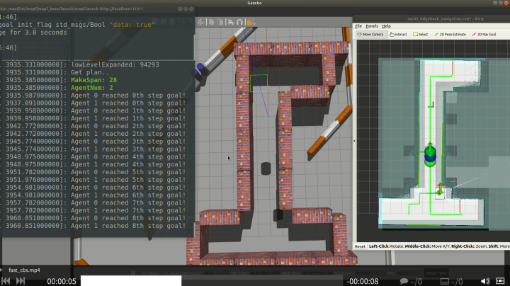
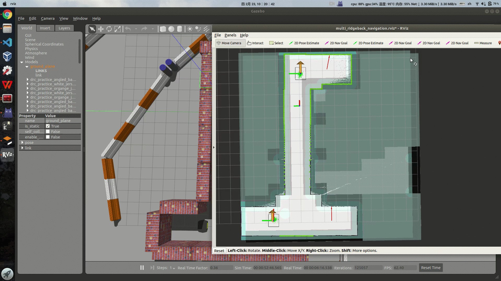
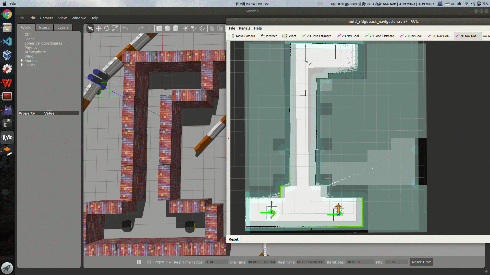
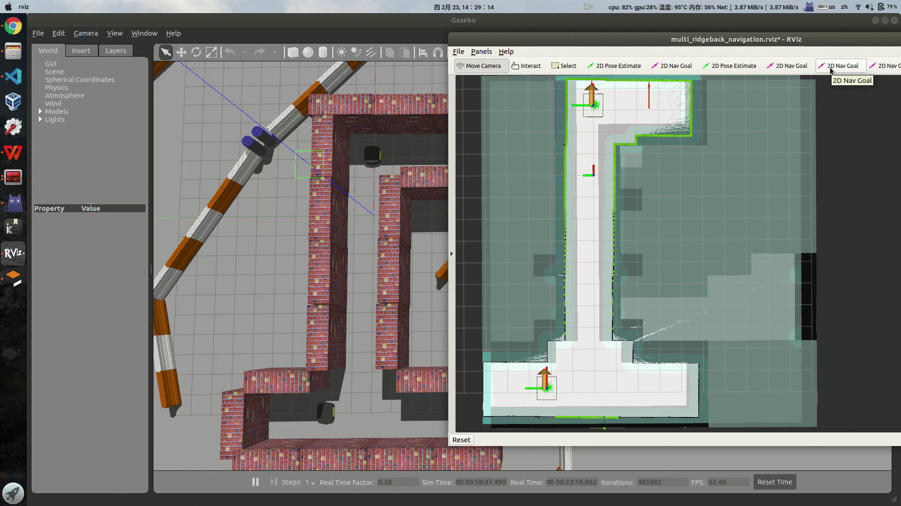
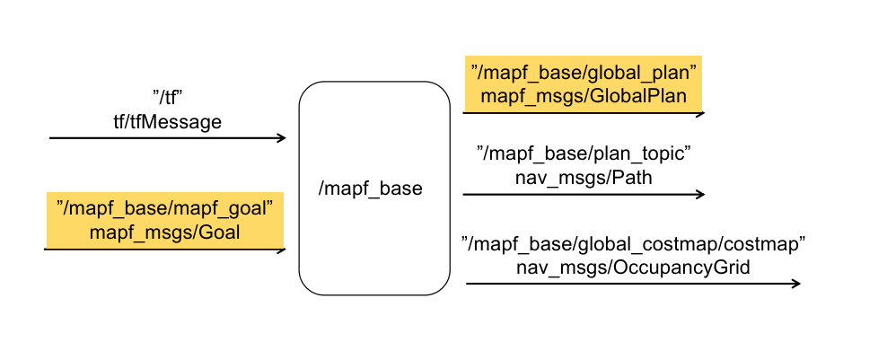
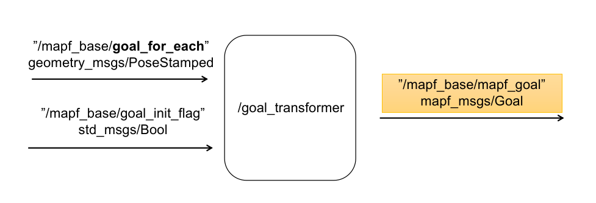
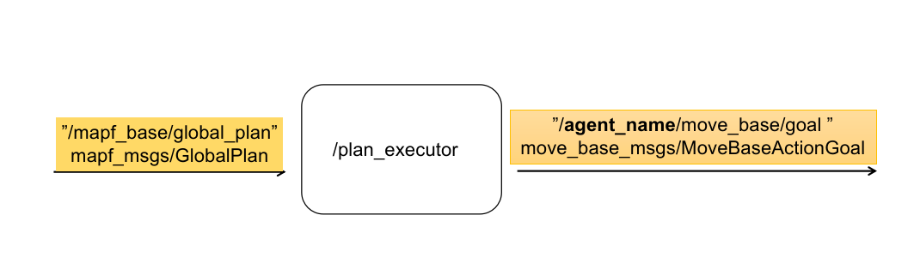
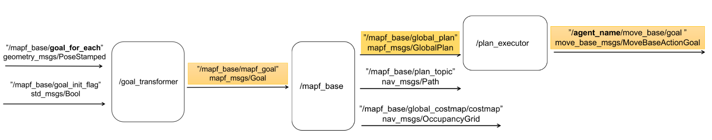
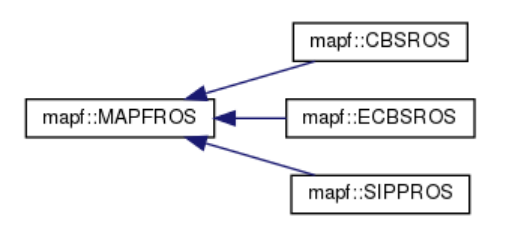

# Multi-Agent Path Finding (MAPF) in ROS

<div align='center'>
  
</div>

<div align='center'>
  <a href='./README.md'>English</a> | 中文
</div>

---

<!-- TOC -->

- [Multi-Agent Path Finding (MAPF) in ROS](#multi-agent-path-finding-mapf-in-ros)
  - [项目简介](#项目简介)
  - [Example](#example)
    - [Conflict-Based Search (CBS)](#conflict-based-search-cbs)
      - [参考文献](#参考文献)
    - [Enhanced Conflict-Based Search (ECBS)](#enhanced-conflict-based-search-ecbs)
      - [参考文献](#参考文献-1)
    - [Prioritized Planning using SIPP](#prioritized-planning-using-sipp)
      - [参考文献](#参考文献-2)
  - [Build](#build)
  - [Launch](#launch)
    - [example launch](#example-launch)
    - [Notes:](#notes)
  - [代码架构](#代码架构)
    - [Nodes](#nodes)
      - [1 mapf\_base](#1-mapf_base)
        - [1.1 节点结构](#11-节点结构)
        - [1.2 订阅话题](#12-订阅话题)
        - [1.3 发布话题](#13-发布话题)
        - [1.4 节点参数](#14-节点参数)
      - [2 goal\_transformer](#2-goal_transformer)
        - [2.1 节点结构](#21-节点结构)
        - [2.2 订阅话题](#22-订阅话题)
        - [2.3 发布话题](#23-发布话题)
        - [2.4 节点参数](#24-节点参数)
      - [3 plan\_executor](#3-plan_executor)
        - [3.1 节点结构](#31-节点结构)
        - [3.2 订阅话题](#32-订阅话题)
        - [3.3 发布话题](#33-发布话题)
        - [3.4 节点参数](#34-节点参数)
      - [4 全局节点结构](#4-全局节点结构)
  - [](#)
    - [ROS 插件结构](#ros-插件结构)

<!-- /TOC -->
<!-- /TOC -->

## 项目简介

多智能体路径规划 (Multi-Agent Path Finding, MAPF) 研究多智能体的路径规划算法，为多机系统规划无冲突的最优路径．

本项目将多机路径规划算法(Multi-Agent Path Finding, MAPF)源码转换为ros实现．算法接口采用ros插件形式编写，利于扩展自己的多机规划方法．

本项目地址：[https://github.com/speedzjy/mapf_ros](https://github.com/speedzjy/mapf_ros)

源算法库：[https://github.com/whoenig/libMultiRobotPlanning](https://github.com/whoenig/libMultiRobotPlanning)

本项目已经实现的多机规划方法有：
- Conflict-Based Search (CBS)
- Enhanced Conflict-Based Search (ECBS)
- Prioritized Planning using SIPP (样例代码, swap情况的判断还未实现)


## Example

gif 展示的测试用例仓库在 [https://github.com/speedzjy/ridgeback_mapf](https://github.com/speedzjy/ridgeback_mapf)

### Conflict-Based Search (CBS)
CBS 是一族方法．算法的思想主要将多机规划分为**两层**，**底层**执行带有约束的单机规划，例如用传统 A* 算法，**顶层**遍历底层的规划路径，解决路径之间的冲突并施加约束．CBS 算法给出 MAPF 问题的全局最优结果．


#### 参考文献

- [Conflict-based search for optimal multi-agent path finding](https://doi.org/10.1016/j.artint.2014.11.006)

### Enhanced Conflict-Based Search (ECBS)

ECBS 基于 CBS, 在给定次优条件下给出比 CBS 更快的次优结果．



#### 参考文献

- [Suboptimal Variants of the Conflict-Based Search Algorithm for the Multi-Agent Pathfinding Problem](https://doi.org/10.1609/socs.v5i1.18315)

### Prioritized Planning using SIPP

SIPP 算法不属于 CBS 类算法，这个算法提出了一个安全间隔(safe intervals)的概念，将时空A*(space-time A*)和CBS类多机路径规划算法的时间维度显著压缩.

实际上，SIPP 是一个考虑动态障碍物轨迹的单机规划算法. 通过将多机系统中的机器人按优先级排列，先进行规划的机器人的轨迹在后进行规划的机器人 SIPP 算法中会被当作动态障碍物轨迹来处理.

源码的作者没有写 swap 情况的处理办法，后续有空研究一下，看看能不能补全．

|             No swap (Success)              |
| :----------------------------------------: |
|  |

|      Swap (Failure)      |
| :----------------------: |
|  |

#### 参考文献

- [SIPP: Safe Interval Path Planning for Dynamic Environments](https://www.cs.cmu.edu/~maxim/files/sipp_icra11.pdf)

## Build

参照普通ros包编译方式:

```bash
catkin_make
```

## Launch

建议先看看下方的 [ 代码架构](#code_structure) 部分, 再来看看 launch.

下面的示例 launch 文件放在 [mapf_base/launch](https://github.com/speedzjy/mapf_ros/blob/main/mapf_base/launch/mapf_example.launch)
### example launch
```xml
<launch>

  <!-- 1.加载低分辨率地图 -->
  <arg name="map" default="mymap_low_resolution.yaml" />
  <group ns="mapf_base">
    <node name="map_server" pkg="map_server" type="map_server" args="$(find ros_package_name)/maps/$(arg map)" />
  </group>

  <!-- 2. launch mapf_base node -->
  <node pkg="mapf_base" type="mapf_base" name="mapf_base" output="screen" respawn="true">
    <rosparam file="$(find mapf_base)/params/costmap_params.yaml" command="load" ns="global_costmap" />
    <rosparam file="$(find mapf_base)/params/mapf_params.yaml" command="load" />

    <!-- 规划器名称参数; possible values: {
    mapf_planner/CBSROS, 
    mapf_planner/ECBSROS,
    mapf_planner/SIPPROS
    } -->
    <param name="mapf_planner" value="mapf_planner/SIPPROS" />
    <!-- <rosparam file="$(find mapf_base)/params/ecbs_params.yaml" command="load" /> -->
  </node>

  <!-- 3. launch goal_transformer and plan_executor -->
  <group ns="mapf_base">
    <node pkg="mapf_base" type="goal_transformer" name="goal_transformer" output="screen"> </node>
    <node pkg="mapf_base" type="plan_executor" name="plan_executor" output="screen"> </node>
  </group>

</launch>
```

有三个参数文件需要配置: [mapf_params.yaml](https://github.com/speedzjy/mapf_ros/blob/main/mapf_base/params/mapf_params.yaml), [costmap_params](https://github.com/speedzjy/mapf_ros/blob/main/mapf_base/params/costmap_params.yaml) and [ecbs_params.yaml](https://github.com/speedzjy/mapf_ros/blob/main/mapf_base/params/ecbs_params.yaml)(If choose ecbs planner).

### Notes: 
强烈建议采用**低分辨率**地图用于 mapf 多机规划，**高分辨率**地图用于单机器人局部规划．原因如下:
- CBS 和 ECBS 都是时空搜索算法, 如果地图维数过大，搜索非常耗时．MAPF 的最优解法是 NP-Complete 问题.
- 由于 mapf 规划的路径是有时间步的，为了保证机器人不发生碰撞，每个时间步之间的最小距离必须大于机器人的直径。

----------------------------------------------------
<a id="code_structure"></a>

## 代码架构
### Nodes
#### 1 mapf_base

##### 1.1 节点结构
mapf_base 节点参照 ros navigation 包中 move_base 的功能，作为 mapf 算法的中央控制器，调度核心算法运行.

**Notes: mapf_base节点只生成 global plan，不下发速度控制命令。 可以按照 plan 的每个 time step 发送给move_base，按照时间步执行控制命令.**



##### 1.2 订阅话题
- /mapf_base/mapf_goal [mapf_msgs/Goal] mapf格式的 goal 信息，包括系统中所有机器人的目标位置
- /tf [tf/tfMessage] 得到 map 到每个机器人的 base_link 的 tf 变换

##### 1.3 发布话题
- /mapf_base/**parameter: plan_topic** [nav_msgs/Path] | 不含时间步的 path, 在 rviz 上可视化使用 
- /mapf_base/global_plan [mapf_msgs/GlobalPlan] | 全局规划，是每个机器人的单独规划的集合，每个单独规划都包含时间步
- /mapf_base/global_costmap/costmap [nav_msgs/OccupancyGrid] | 用于 mapf 的 costmap

##### 1.4 节点参数
- ~mapf_planner: (string, default: "mapf_planner/CBSROS") | mapf规划器名称
- ~agent_num: (int, default: 2) | 多机系统机器人数量
- ~global_frame_id: map (string, default: map) | 地图和 /tf 的全局 frame

- ~planner_time_tolerance: 5.0 (double, default: DBL_MAX) | mapf 算法非常耗时，设置时间阈值，超时则算法退出
- ~goal_tolerance: 1.0 (double, default: 1.0) | mapf 算法到目标点的允差阈值，一旦机器人与目标点距离小于阈值，mapf 算法将停止规划，最好设成与用于 mapf 的地图分辨率相同

- ~base_frame_id: (string, default: "base_link") | 每个机器人的 base_link frame_id, example:
  - base_frame_id:
    - agent_0: rb_0/base_link
    - agent_1: rb_1/base_link

- ~plan_topic: (string, default: "plan") | 在 rviz 上可视化的不含时间步的 path 会发布在这个话题上, example:
  - plan_topic:
    - agent_0: rb_0/plan
    - agent_1: rb_1/plan
----------------------------------------

以下两个节点用于mapf算法的测试．你也可以编写自己的节点，只需要处理好 mapf_base 节点的输入输出．

#### 2 goal_transformer

##### 2.1 节点结构
goal_transformer 节点用于将每个节点的目标信息整合为 mapf 格式的目标信息发布



##### 2.2 订阅话题
- **parameter: goal_topic** [geometry_msgs/PoseStamped] | 订阅每个机器人的目标信息
- /mapf_base/goal_init_flag [std_msgs/Bool] | 值如果为 true, 将接收到的每个 goal　信息整合为 mapf 格式的 goal发布

##### 2.3 发布话题
- /mapf_base/mapf_goal [mapf_msgs/Goal] | 发布 mapf 格式的 goal 给 mapf_base 节点处理

##### 2.4 节点参数

- ~goal_topic: (string, default: "rb_0/goal") | 本节点将从这个话题接收每个机器人的 goal, example:
  - goal_topic:
    - agent_0: rb_0/goal
    - agent_1: rb_1/goal

#### 3 plan_executor

##### 3.1 节点结构
plan_executor 节点根据 mapf_base 生成的 plan，按照时间步顺序发送给 move_base 执行局部规划



##### 3.2 订阅话题
- /mapf_base/global_plan [mapf_msgs/GlobalPlan] | mapf_base 发布的全局规划

##### 3.3 发布话题

- /**agent_name**/move_base/goal [move_base_msgs/MoveBaseActionGoal] | 发给每个机器人的 move_base

##### 3.4 节点参数
- ~agent_name: (string, default: "rb_0") | 机器人名称 (话题 "(arg agent_name)/move_base/goal" 将被发给 move_base), example:
  - agent_name:
    - agent_0: rb_0
    - agent_1: rb_1

#### 4 全局节点结构


---------------------------
### ROS 插件结构



